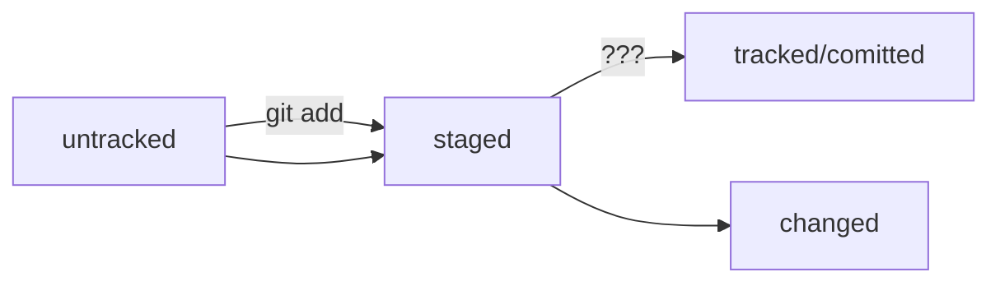

# Справка по git чтобы не забыть
---
## Выставляем глобальные настройки
### Имя пользователя
`git config --global user.name "[имя]"`

### Почта
`git config --global user.email "[адрес электронной почты]"`

### В папке создаем репозиторий
`git init [название проекта]`

### Создаёт новый локальный репозиторий с заданным именем (если надо брать клон)
`$ git clone [url-адрес]`

### Создать SSH ключ
`ssh-keygen -t ed25519 -c "[адрес электронной почты]"`

### Связать удаленный git проект с текущим (если предварительно на github создали пустой репозиторий с таким же именем)
`git remote add origin git@github.com:Alexander-Savelev/test-git-project.git`
`git push -u origin master #только первый раз потом можно просто git push `

##Просмотр изменений и создание коммитов (фиксация изменений)

### Перечисляет все новые или изменённые файлы, которые нуждаются в фиксации
`$ git status`

### Посмотреть историю
`$ git log`

### Показывает различия по внесённым изменениям в ещё не проиндексированных файлах
`$ git diff`

### Индексирует указанный файл для последующего коммита
`$ git add [файл]`

### Показывает различия между проиндексированной и последней зафиксированной версиями файлов
`$ git diff --staged`

### Отменяет индексацию указанного файла, при этом сохраняет его содержимое
`$ git reset [файл]`

### Отменить индексацию по изменениям в файле
`git restore --staged <file>` перевод файла из `staged` обратно в `modified` или `untracked`

### Отменить изменения по файлу 
`git restore <file>` откатит изменения в файле до последеней сохраненной (в коммите или staging) версии

### Фиксирует проиндексированные изменения и сохраняет их в историю версий
`$ git commit -m "[сообщение с описанием]"`

### Отменить коммит и все последующие
`git reset --hard <commit hash>` откатит историю до каммита с хешем `<hash>`. Более поздник коммиты потеряются!

### Синхронизация с удалённым репозиторием
### Скачивает всю историю из удалённого репозитория
`$ git fetch [удалённый репозиторий]`

### Вносит изменения из ветки удалённого репозитория в текущую ветку локального репозитория
`$ git merge [удалённый репозиторий]/[ветка]`

### Загружает все изменения локальной ветки в удалённый репозиторий (без аргументов в мастер)
`$ git push [удалённый репозиторий] [ветка]`

### Загружает историю из удалённого репозитория и объединяет её с локальной. pull = fetch + merge
`$ git pull`

